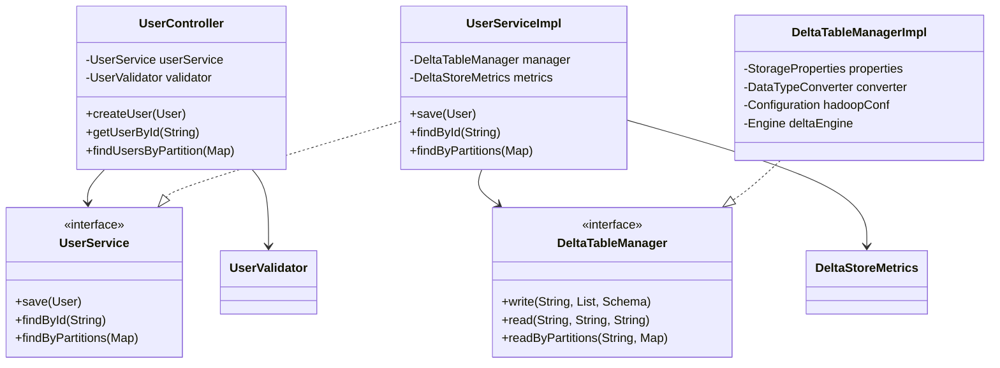

# Delta Store Service - Design Documentation

## Table of Contents
1. [Design Principles](#design-principles)
2. [API Design](#api-design)
3. [Data Model Design](#data-model-design)
4. [Class Design](#class-design)
5. [Storage Design](#storage-design)
6. [Error Handling Design](#error-handling-design)
7. [Security Design](#security-design)
8. [Performance Design](#performance-design)
9. [Testing Design](#testing-design)
10. [Configuration Design](#configuration-design)

## Design Principles

### Core Principles
1. **Single Responsibility**: Each class has one reason to change
2. **Dependency Inversion**: Depend on abstractions, not concretions
3. **Interface Segregation**: Clients shouldn't depend on unused methods
4. **Open/Closed**: Open for extension, closed for modification
5. **DRY (Don't Repeat Yourself)**: Avoid code duplication
6. **YAGNI (You Aren't Gonna Need It)**: Implement only what's needed

### Architectural Patterns
- **Layered Architecture**: Clear separation of concerns
- **Repository Pattern**: Abstract data access
- **Service Pattern**: Business logic encapsulation
- **DTO Pattern**: Data transfer objects for API contracts
- **Builder Pattern**: Complex object construction (Avro records)

## API Design

### RESTful Design Principles

#### Resource Naming
```
/api/v1/{resource-plural}/{resource-id}
/api/v1/users/{userId}
```

#### HTTP Methods
- **POST**: Create resources (idempotent with client-provided IDs)
- **GET**: Retrieve resources (safe, idempotent)
- **PUT**: Update resources (not implemented - future)
- **DELETE**: Remove resources (not implemented - future)

#### Status Codes
```java
201 Created     - Resource successfully created
200 OK          - Successful retrieval
400 Bad Request - Validation errors
404 Not Found   - Resource doesn't exist
500 Internal    - Server errors
```

### API Contracts

#### Create User Request
```json
POST /api/v1/users
Content-Type: application/json

{
  "user_id": "u123",
  "username": "john_doe",
  "email": "john@example.com",
  "country": "US",
  "signup_date": "2024-01-15"
}
```

#### Error Response Format
```json
{
  "errors": [
    "User ID is required",
    "Invalid email format"
  ]
}
```

#### Query by Partition
```
GET /api/v1/users?country=US&signup_date=2024-01-15
```

### API Versioning Strategy
- **URL Path Versioning**: `/api/v1/`, `/api/v2/`
- Maintains backward compatibility
- Clear version visibility

## Data Model Design

### Avro Schema Design

#### User Schema
```avro
{
  "type": "record",
  "name": "User",
  "namespace": "com.example.deltastore.schemas",
  "fields": [
    {"name": "user_id", "type": "string"},
    {"name": "username", "type": "string"},
    {"name": "email", "type": ["null", "string"], "default": null},
    {"name": "country", "type": "string"},
    {"name": "signup_date", "type": "string"}
  ]
}
```

#### Design Decisions
- **String IDs**: Flexibility over numeric IDs
- **Optional Fields**: Null union types with defaults
- **Date as String**: Simplicity, ISO-8601 format
- **Flat Structure**: Avoid nested complexity initially

### Partitioning Design

#### Partition Strategy
```
/table/country=US/signup_date=2024-01-15/
       country=UK/signup_date=2024-01-15/
```

#### Design Rationale
- **Geographic Distribution**: Country-based filtering
- **Time-based Analysis**: Date partitioning for trends
- **Query Performance**: Partition pruning optimization
- **Data Lifecycle**: Easy date-based archival

## Class Design

### Package Structure
```
com.example.deltastore/
├── api/
│   └── controller/       # REST controllers
├── config/              # Configuration classes
├── domain/
│   └── model/          # Domain models
├── exception/          # Custom exceptions
├── metrics/            # Metrics collection
├── service/            # Business logic
│   └── optimization/   # Background jobs
├── storage/            # Data access layer
├── util/               # Utility classes
└── validation/         # Input validation
```

### Key Class Relationships



### Design Patterns Applied

#### Dependency Injection
```java
@RequiredArgsConstructor  // Constructor injection
public class UserServiceImpl implements UserService {
    private final DeltaTableManager deltaTableManager;
    private final DeltaStoreMetrics metrics;
}
```

#### Builder Pattern (Avro)
```java
User user = User.newBuilder()
    .setUserId("u123")
    .setUsername("john")
    .build();
```

#### Template Method (Metrics)
```java
Timer.Sample sample = metrics.startWriteTimer();
try {
    // operation
    metrics.recordWriteSuccess(TABLE_NAME, 1);
} catch (Exception e) {
    metrics.recordWriteFailure(TABLE_NAME, e.getClass().getSimpleName());
    throw e;
} finally {
    metrics.stopWriteTimer(sample, TABLE_NAME);
}
```

## Storage Design

### Delta Lake File Organization

#### Directory Structure
```
/tmp/delta-tables/               # Local testing
  └── bucket-name/
      └── users/
          ├── _delta_log/         # Transaction log
          │   └── 00000.json      # Commit metadata
          └── part-*.parquet      # Data files
```

#### Transaction Log Design
```json
{
  "protocol": {"minReaderVersion": 1, "minWriterVersion": 2},
  "metaData": {
    "schemaString": "...",
    "partitionColumns": ["country", "signup_date"],
    "configuration": {}
  },
  "add": {
    "path": "part-00000-uuid.parquet",
    "partitionValues": {"country": "US", "signup_date": "2024-01-15"},
    "size": 1024,
    "stats": "{\"numRecords\":100}"
  }
}
```

### Storage Abstraction

#### Configuration-based Storage
```java
@Profile("local")  // MinIO for development
@Profile("prod")   // AWS S3 for production
```

#### Storage Properties
```yaml
app:
  storage:
    bucket-name: ${STORAGE_BUCKET_NAME}
    endpoint: ${STORAGE_ENDPOINT}
    access-key: ${STORAGE_ACCESS_KEY}
    secret-key: ${STORAGE_SECRET_KEY}
```

## Error Handling Design

### Exception Hierarchy
```java
public class DeltaStoreException extends RuntimeException {
    // Base exception for all custom errors
}

public class TableWriteException extends DeltaStoreException {
    // Write operation failures
}

public class TableReadException extends DeltaStoreException {
    // Read operation failures
}
```

### Validation Design

#### Field-Level Validation
```java
public class UserValidator {
    private static final Pattern EMAIL_PATTERN = 
        Pattern.compile("^[A-Za-z0-9+_.-]+@[A-Za-z0-9.-]+\\.[A-Za-z]{2,}$");
    
    private static final Pattern USER_ID_PATTERN = 
        Pattern.compile("^[a-zA-Z0-9_-]{1,50}$");
        
    public List<String> validate(User user) {
        List<String> errors = new ArrayList<>();
        // Accumulate all errors for better UX
        return errors;
    }
}
```

### Error Response Strategy
- **Client Errors (4xx)**: Detailed validation messages
- **Server Errors (5xx)**: Generic messages, detailed logs
- **Correlation IDs**: Track errors across services

## Security Design

### Input Validation
```java
// Pattern-based validation
USER_ID_PATTERN = "^[a-zA-Z0-9_-]{1,50}$"

// Length constraints
if (user.getUsername().length() > 100) {
    errors.add("Username must be 100 characters or less");
}

// Null/empty checks
if (!StringUtils.hasText(userId)) {
    return ResponseEntity.badRequest();
}
```

### SQL Injection Prevention
- **Parameterized Queries**: Delta Kernel handles escaping
- **Input Sanitization**: Pattern matching for IDs
- **No Direct SQL**: All operations through Delta API

### Sensitive Data Handling
```java
// Mask sensitive data in logs
log.debug("Using access key: {}", 
          storageProperties.getMaskedAccessKey());
          
// Don't log full user data
log.info("Creating user with ID: {}", user.getUserId());
```

## Performance Design

### Optimization Strategies

#### Partition Pruning
```java
// Efficient: Uses partition filters
readByPartitions("users", Map.of("country", "US"));

// Inefficient: Full table scan
read("users", "user_id", "u123");
```

#### Batch Processing
```java
// Write multiple records in single transaction
deltaTableManager.write(TABLE_NAME, recordList, schema);
```

#### Resource Management
```java
// Reusable Delta Engine
private final Engine engine = DefaultEngine.create(hadoopConf);

// Connection pooling handled by AWS SDK
```

### Metrics Design

#### Timer Pattern
```java
public Timer.Sample startWriteTimer() {
    return Timer.start(meterRegistry);
}

public void stopWriteTimer(Timer.Sample sample, String tableName) {
    sample.stop(Timer.builder("deltastore.write.duration")
            .tags("table", tableName)
            .register(meterRegistry));
}
```

#### Counter Pattern
```java
meterRegistry.counter("deltastore.records.written", 
                      "table", tableName)
             .increment(recordCount);
```

## Testing Design

### Test Strategy

#### Unit Tests
```java
@WebMvcTest(UsersController.class)
class UsersControllerTest {
    @MockBean
    private UserService userService;
    
    // Test HTTP layer in isolation
}
```

#### Integration Tests
```java
@SpringBootTest
@AutoConfigureMockMvc
class UsersControllerIntegrationTest {
    // Test full request/response cycle
}
```

#### Test Data Builders
```java
User testUser = User.newBuilder()
    .setUserId("test-user")
    .setUsername("testuser")
    .setCountry("US")
    .setSignupDate("2024-01-01")
    .build();
```

### Mocking Strategy
- **Mockito**: Service layer mocking
- **MockMvc**: HTTP layer testing
- **TestContainers**: MinIO for integration tests

## Configuration Design

### Environment-Specific Configuration

#### Profile-Based Configuration
```yaml
# application.yml - Common settings
spring:
  profiles:
    active: ${SPRING_PROFILES_ACTIVE:local}

# application-local.yml - Development
app:
  storage:
    endpoint: http://localhost:9000

# application-prod.yml - Production  
app:
  storage:
    endpoint: # Use AWS defaults
```

### Configuration Classes

#### Type-Safe Properties
```java
@ConfigurationProperties(prefix = "app.storage")
@Validated
public class StorageProperties {
    @NotBlank
    private String bucketName;
    
    @NotBlank
    private String endpoint;
    
    // Getters with validation
}
```

#### Schema Registry Configuration
```java
@Configuration
public class SchemaRegistryConfig {
    @Bean
    public Map<String, TableSchema> tableSchemas() {
        // Load schemas from classpath
        // Parse Avro definitions
        // Build table metadata
    }
}
```

### Externalization Strategy
- **Environment Variables**: Secrets and endpoints
- **YAML Files**: Application structure
- **Classpath Resources**: Schemas and static config

## Design Quality Attributes

### Maintainability
- Clear package structure
- Interface-based design
- Comprehensive logging
- Self-documenting code

### Scalability
- Stateless services
- Horizontal scaling ready
- Partition-based sharding
- Async processing capable

### Reliability
- Comprehensive error handling
- Transaction support
- Metric monitoring
- Health checks

### Testability
- Dependency injection
- Interface abstractions
- Mock-friendly design
- Integration test support

### Performance
- Efficient partitioning
- Batch operations
- Resource pooling
- Metric tracking

## Design Trade-offs

### Simplicity vs Features
- **Choice**: Start simple, evolve gradually
- **Example**: No update/delete initially

### Type Safety vs Flexibility
- **Choice**: Strong typing with Avro
- **Trade-off**: More complex than JSON

### Performance vs Consistency
- **Choice**: Eventually consistent reads
- **Trade-off**: Possible stale data

### Development Speed vs Production Ready
- **Choice**: Local file system for development
- **Trade-off**: Additional configuration complexity

## Future Design Considerations

### API Evolution
- GraphQL for flexible queries
- WebSocket for real-time updates
- gRPC for internal services

### Data Model Evolution
- Schema versioning strategy
- Backward compatibility rules
- Migration tooling

### Performance Optimization
- Read caching layer
- Write buffering
- Query optimization
- Index management

### Operational Excellence
- Circuit breakers
- Retry policies
- Rate limiting
- Request tracing